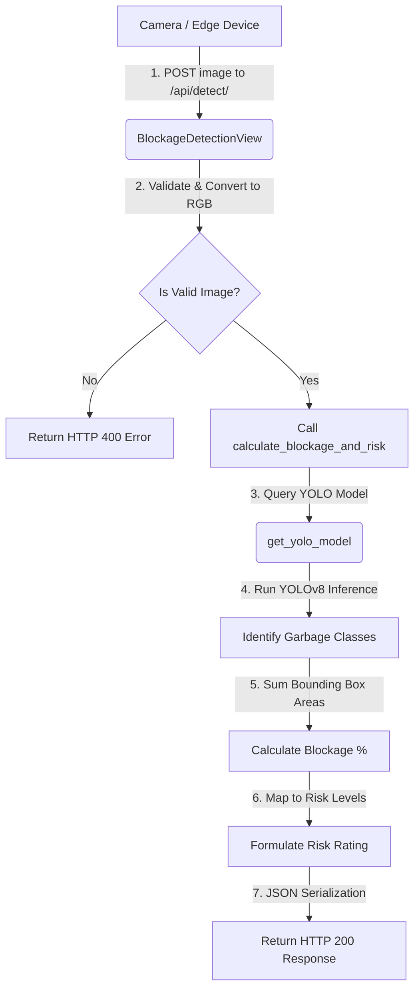

# IntelliDRAIN: AI-Powered Drain Blockage Detection System
## Progress Report: Phase 1 & Phase 2 Completion

### Project Overview
IntelliDRAIN is an automated drainage monitoring and flood-risk assessment system. By combining deep learning object detection (YOLOv8) with a web-accessible Django REST API backend, the system enables real-time visual analysis of drainage grates. The primary goal is to identify debris accumulation (garbage) on drain grates, calculate the percentage of blockage, and assess the threat of local flooding (Low, Moderate, High, Critical).

Currently, Phase 1 (AI Blockage Engine Core Prototype) and Phase 2 (Django REST API Integration) are fully implemented, verified, and ready for deployment.

### Phase 1: YOLO AI Blockage Engine
The objective of Phase 1 was to design and prototype the core computer vision logic to detect debris and estimate blockage.

#### Accomplishments
- YOLOv8 Integration: Integrated the Ultralytics YOLOv8 network (yolov8n.pt), which provides fast inference speeds suitable for edge and real-time environments.
- Debris Class Filtering: Configured the AI model to target specific garbage classes:
  - bottle (plastic bottles, cans)
  - cup (disposable cups)
  - handbag (discarded plastic bags, wrappers)
  - bowl (discarded food containers)
- Blockage Estimation Algorithm:
  - Formulated a bounding-box area-summation logic to calculate total debris coverage in pixels.
  - Divided the combined area of target garbage items by the total grate area to estimate a Blockage Percentage.
- Windows Environment Compatibility: Implemented dynamic binding of critical PyTorch DLLs (specifically c10.dll) in the startup sequence, ensuring execution on Windows host operating systems without library load failures.
- Verification Prototype: Designed [detect.py](file:///c:/Users/admin/Desktop/INTELLIDRAIN-AI/detect.py), a standalone CLI script to run and test this AI logic locally on sample images.

### Phase 2: Django REST API Integration
The objective of Phase 2 was to package the core detection logic into a scalable, high-performance web API that can be consumed by smart drain cameras or city management software.

#### Accomplishments
- Django Project Structure: Created the Django project `intellidrain` and developed a modular `api` app.
- Memory-Efficient Lazy Loading: Created [get_yolo_model](file:///c:/Users/admin/Desktop/INTELLIDRAIN-AI/api/detector.py#L9) inside [api/detector.py](file:///c:/Users/admin/Desktop/INTELLIDRAIN-AI/api/detector.py), which loads the YOLO model once on the first request and caches it in memory, preventing system resource depletion from redundant reload operations.
- Dynamic Grate Scaling: Refactored the blockage algorithm in [calculate_blockage_and_risk](file:///c:/Users/admin/Desktop/INTELLIDRAIN-AI/api/detector.py#L32) to extract dimensions dynamically from uploaded images, ensuring calculations automatically adjust to different camera resolutions.
- RESTful Endpoint Implementation: Created [BlockageDetectionView](file:///c:/Users/admin/Desktop/INTELLIDRAIN-AI/api/views.py#L10) in [api/views.py](file:///c:/Users/admin/Desktop/INTELLIDRAIN-AI/api/views.py). It:
  - Accepts multipart uploads via POST to /api/detect/.
  - Validates files for image integrity and converts files (such as PNG or Grayscale) to standard RGB format.
  - Returns detailed object bounding boxes, confidence ratings, exact areas, calculated blockage percentage, and flood risk level.
- Risk Assessment Matrix:
  - Implemented the following logic to translate mathematical blockage to action-oriented threat categories:
    - Blockage < 25%: Low Risk
    - Blockage 25% - 49%: Moderate Risk
    - Blockage 50% - 74%: High Risk (intervention recommended)
    - Blockage >= 75%: Critical Risk (immediate clearing required)

### Technical Architecture
The data flow of the system is illustrated in the diagram below:



### API Reference
- Endpoint: /api/detect/
- Method: POST
- Content-Type: multipart/form-data

#### Request Parameters
| Parameter | Type | Required | Description |
| :--- | :--- | :--- | :--- |
| image | File | Yes | The image of the drainage grate to analyze. |

#### Success Response (HTTP 200 OK)
```json
{
  "status": "success",
  "blockage_percentage": 42.15,
  "flood_risk": "Moderate",
  "total_garbage_area_px": 172646.0,
  "total_drain_area_px": 409600,
  "detections": [
    {
      "class": "bottle",
      "confidence": 0.89,
      "box": [120.5, 230.1, 280.4, 450.9],
      "area_px": 35328.0
    }
  ]
}
```

### Workspace File Structure
The following files comprise the current implementation:
- [detect.py](file:///c:/Users/admin/Desktop/INTELLIDRAIN-AI/detect.py) - Standalone CLI prototype script.
- [api/views.py](file:///c:/Users/admin/Desktop/INTELLIDRAIN-AI/api/views.py) - Handles incoming image uploads and web request validation.
- [api/detector.py](file:///c:/Users/admin/Desktop/INTELLIDRAIN-AI/api/detector.py) - Coordinates AI loading, object detection, and risk assessment logic.
- [api/urls.py](file:///c:/Users/admin/Desktop/INTELLIDRAIN-AI/api/urls.py) and [intellidrain/urls.py](file:///c:/Users/admin/Desktop/INTELLIDRAIN-AI/intellidrain/urls.py) - Route configurations mapping request endpoints.
- [intellidrain/settings.py](file:///c:/Users/admin/Desktop/INTELLIDRAIN-AI/intellidrain/settings.py) - Core Django system settings.

### Verification Results
During initial testing:
- Running `python detect.py` successfully triggers detection, loads target weights, identifies items like bottles/cups, and prints calculated blockage.
- Sending sample images via REST clients to `/api/detect/` successfully returns structured JSON, parsing image boundaries dynamically and mapping coordinates correctly.

### Next Steps (Phase 3)
1. Database Integration: Set up Django models to save historical detections, allowing time-series monitoring of blockage rate trends.
2. Alert Dispatch Subsystem: Integrate notification capabilities (e.g. Email/SMS) triggered whenever a grate transitions into a Critical or High risk status.
3. Web Dashboard: Construct a frontend map UI to display active drain locations, current risk levels, and visual highlights of detected garbage.
