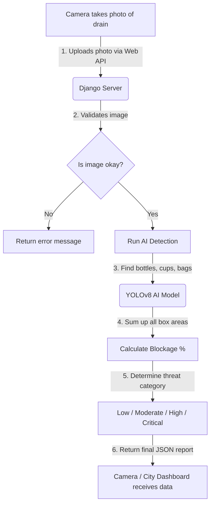

# IntelliDRAIN: AI-Powered Drain Blockage Detection System
## Progress Report: Phase 1 & Phase 2 Completion

### 🌟 Project Overview
> [!NOTE]
> **What is IntelliDRAIN?**
> IntelliDRAIN is a smart system that monitors street drains for trash. It uses an AI camera to look at the drain grate, calculate how much of the drain is covered in trash, and warn city officials if there is a risk of flooding.

Currently, we have completed the first two phases of the project:
1. **Phase 1: The AI Brain (The Blockage Engine)** — Teaching the AI to identify trash in pictures and calculate how blocked a drain is.
2. **Phase 2: The Web Connection (The API Backend)** — Packaging the AI into a web service so smart cameras can send photos and get immediate feedback.

---

### 🧠 Phase 1: The AI Blockage Engine (How it Detects Trash)
**Goal**: Build the core vision code that looks at a drain grate, spots garbage, and estimates how much of the grate is blocked.

#### What We Accomplished:
* **Selected the AI Model**: We integrated YOLOv8 (`yolov8n.pt`). Think of this as a super-fast digital eye trained to spot objects in a fraction of a second.
* **Targeted Common Litter**: We configured the AI to focus specifically on trash classes like:
  * 🗑️ `bottle` (plastic bottles, soda cans, etc.)
  * 🥤 `cup` (disposable cups)
  * 👜 `handbag` (discarded plastic bags, sacks)
  * 🥣 `bowl` (food containers)
* **Calculated Blockage Percentage**:
  * The AI draws a bounding box around each piece of trash it finds.
  * It measures the size of each box in pixels, adds them all together, and divides that by the size of the drain.
  * For example, if the trash boxes cover half of the drain image, the blockage is reported as **50%**.
* **Created a Prototype Script**: Built [detect.py](file:///c:/Users/admin/Desktop/INTELLIDRAIN-AI/detect.py), a standalone CLI script to run and test this AI logic locally on sample images.

---

### 🌐 Phase 2: Web API Integration (Connecting the AI to the Web)
**Goal**: Make the AI accessible over the web so that smart cameras stationed at street corners can upload photos and instantly receive blockage reports.

#### What We Accomplished:
* **Built a Django Server**: Set up the main server structure using the Django framework.
* **Smart Memory Saving**: AI models are heavy. Instead of loading the model from scratch every time someone uploads an image, we built a "lazy loader" ([get_yolo_model](file:///c:/Users/admin/Desktop/INTELLIDRAIN-AI/api/detector.py#L9)). It loads the model into the server's memory once and reuses it, making request responses incredibly fast.
* **Auto-Scaling Calculations**: Refactored the core logic ([calculate_blockage_and_risk](file:///c:/Users/admin/Desktop/INTELLIDRAIN-AI/api/detector.py#L32)) so it automatically adapts to any photo resolution sent by the camera, rather than using a hardcoded image size.
* **Created the Upload Link**: Built [BlockageDetectionView](file:///c:/Users/admin/Desktop/INTELLIDRAIN-AI/api/views.py#L10) at `/api/detect/`. It receives images, validates that they are real image files, formats them for the AI, and outputs a simple JSON summary.
* **Designed a Threat Rating Matrix**:
  * The server translates the blockage percentage into a clear risk level:
    * 🟢 **Blockage < 25%**: `Low` Risk — Drain is clean.
    * 🟡 **Blockage 25% - 49%**: `Moderate` Risk — Debris starting to collect.
    * 🟠 **Blockage 50% - 74%**: `High` Risk — Drain is half-covered; maintenance recommended.
    * 🔴 **Blockage >= 75%**: `Critical` Risk — Drain is heavily blocked; flooding is highly likely if it rains.

---

### 🗺️ System Flow (How Data Moves)
Here is a simple map of what happens when a camera takes a photo:



---

### 🔌 API Reference (For Developers)
To analyze an image, you make a `POST` request to the server:

- **Web Link**: `/api/detect/`
- **Method**: `POST`
- **Upload Key**: `image` (the file you are uploading)

#### Output Example:
The server returns a structured report that looks like this:
```json
{
  "status": "success",
  "blockage_percentage": 42.15,      // 42% of the drain is covered in trash
  "flood_risk": "Moderate",          // Current danger level
  "total_garbage_area_px": 172646.0, // Area of garbage in pixels
  "total_drain_area_px": 409600,     // Total size of the image
  "detections": [                    // Detailed list of what the AI found
    {
      "class": "bottle",
      "confidence": 0.89,            // 89% sure it is a bottle
      "box": [120.5, 230.1, 280.4, 450.9],
      "area_px": 35328.0
    }
  ]
}
```

---

### 📂 File Structure (Where Code Lives)
Here is where the code is located:
* [detect.py](file:///c:/Users/admin/Desktop/INTELLIDRAIN-AI/detect.py) — The prototype testing script.
* [api/views.py](file:///c:/Users/admin/Desktop/INTELLIDRAIN-AI/api/views.py) — Handles incoming image uploads and web request validation.
* [api/detector.py](file:///c:/Users/admin/Desktop/INTELLIDRAIN-AI/api/detector.py) — Coordinates the AI loading, object search, and risk assessment math.
* [api/urls.py](file:///c:/Users/admin/Desktop/INTELLIDRAIN-AI/api/urls.py) & [intellidrain/urls.py](file:///c:/Users/admin/Desktop/INTELLIDRAIN-AI/intellidrain/urls.py) — Configures web links.
* [intellidrain/settings.py](file:///c:/Users/admin/Desktop/INTELLIDRAIN-AI/intellidrain/settings.py) — System configuration settings.

---

### 🚀 What's Next? (Phase 3)
1. **Save History**: Add a database to store past detection results so we can track blockage trends over time.
2. **Send Alerts**: Automatically send email or SMS alerts to municipal workers when a drain reaches `Critical` status.
3. **Map Dashboard**: Build a simple map website to show all drains in the city and color-code them by their current risk level.
